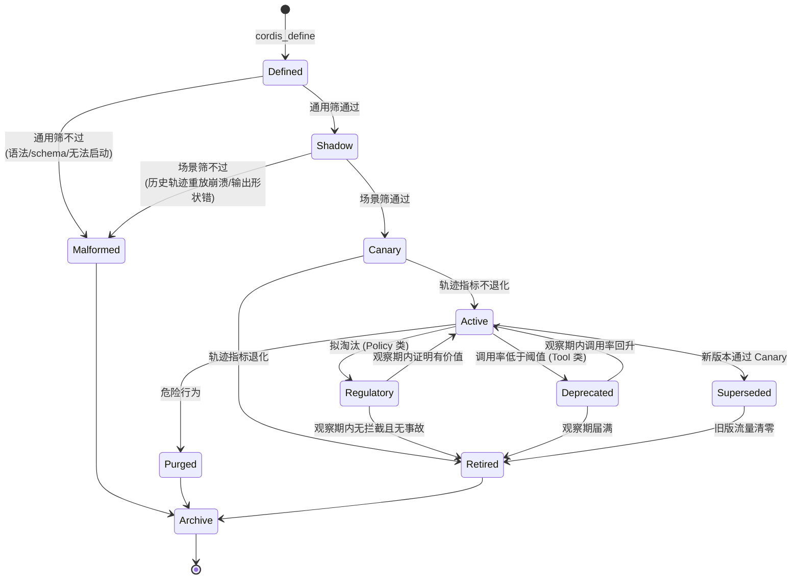

# Thymus — 设计基础

自我成长 Agent 的器官管理层，构建于 DeepSeek Harness (dsh) 之上。

## 命名

胸腺不生产细胞，它只决定哪些细胞能活着离开。T 细胞在此经历中枢选择：中亲和力者正选择放行，高亲和力自反应者克隆清除，低亲和力者死于忽视，另有一部分克隆转向为调节角色。

本项目造的不是器官，是**选器官的装置**。名称取此意。

免疫学同时是本项目跨领域参照的主线（见第 6 节），名称使这一渊源显式化。

| 项 | 值 |
|---|---|
| 文档状态 | 设计基础，未进入实现 |
| 依据的 dsh 版本 | 0.1.0-rc.7 |
| 核实日期 | 2026-08-18 |
| 有效性说明 | dsh 处于 developer preview，官方声明会有破坏性变更。第 2 节的全部事实需在实现前复核。 |

---

## 1. 项目定位

dsh 的架构是「一切皆插件」，插件由人编写、安装、常驻。本项目要做的是让 Agent 依据 spec、目标或与用户讨论出的意图**自行编写插件并挂载**，并对这些插件建立完整的生命周期管理：出生前筛查、在役评价、版本演进、退役归档。

产出物不是插件本身，而是**插件的产房、履历系统与档案馆**。

---

## 2. 基础设施核查

### 2.1 自我修改原语（已具备）

dsh 的 `packages/extensions/` 目录标题为 "the agent modifies its own runtime"，提供五个面向模型的工具：

| 工具 | 能力 |
|---|---|
| `cordis_inspect` | 读取当前进程内全部存活的 plugin fiber、service、工具、事件契约 |
| `cordis_define` | 模型编写 package，经语法检查与 schema 规范化后登记，铸 `dyn-<n>` 号 |
| `cordis_run` | 在 `node:vm` 沙箱中求值并挂载，同时向浏览器端投递 client half |
| `cordis_stop` | 卸载至完全静默，定义保留 |
| `cordis_undefine` | 停止并遗忘定义 |

上游在设计文档中已解决三个关键问题：

1. **注册即校验**。畸形的 tool schema 在注册当场失败，而非等到后续组装 prompt 时才暴露。
2. **契约可见**。`cordis_inspect what:"api"` 渲染的 `api-catalog.ts` 由 workspace AST 生成，与 docs 同源，有 `verify-cordis-api` 卡新鲜度，且只渲染可调用且可 inject 的方法。模型不需要盲猜框架签名。
3. **完全可弃**。动态包挂在内部 `cordis-dynamic` group 下，`unmount` 需等待其拥有的全部工具、监听器、service、timer、effect 达到静默才返回。

补充能力：动态包之间可用标准 Cordis 语义组合。A 执行 `ctx.provide('foo', v)`，B 声明 `inject:['foo']` 后在 foo 出现时激活；卸载 A 会使 B 退回 pending 并 unwind 其注册，重新 provide 时以全新沙箱重跑 apply。器官之间可以有依赖关系。

### 2.2 轨迹与检索（已具备）

| 需求 | dsh 对应能力 |
|---|---|
| 记录 | `session` append-only 日志，附「model-visible ⟺ logged」运行时不变量断言 |
| 检索 | `session-query` + SQLite 全文检索，支持 relationship queries、traces、filters |
| 模型自查历史 | `tool-session-query` |
| 成本度量 | `token-meter` 子系统、`session-telemetry` / `session-telemetry-otel`、`session-stats` |
| 目标状态变迁 | `goal` 的 lifecycle snapshots 与 change records |
| 自我修改留痕 | mount/unmount 记为 `tool/call` + `tool/result`；工具集变更记为完整的 changed request header |

### 2.3 作用域与可逆性（已具备）

- effect 可逆：插件卸载时其注册全部 unwind。
- 作用域链 `agent → preset → global`，近者遮蔽远者。能力集可按单个 agent 隔离。
- `agent-presets` 的 discovery 不做记忆化，运行期新写的 preset 立即可见；`recompose()` 可为存活 agent 更换 preset。

三者叠加的结果：**运行时反事实消融是可行的**。这是本项目评价体系的技术前提，详见 5.3。

### 2.4 上游明确不做的三件事

以下三项在 dsh 文档中为显式设计决定，非遗留缺口。这三项构成本项目的实际工作范围。

| 缺口 | 上游原文依据 |
|---|---|
| **固化落盘** | 动态包 "create no Plugin file, install no package, change no `cordis.yml`..., do not survive restart, and have no automatic save, promote, or install path" |
| **自我认证** | Ralph 工具的完成与阻塞状态是 "worker reports, not independent evaluation" |
| **安全边界** | 沙箱 "is not a security boundary"，"may affect other sessions in that process"，建议按 bash 权限对待 |

上游同时留出两处扩展位：`cordis/mount` 类持久 session event "remains addable if an audit use case needs the mount source and name outside the tool call"；结构化注册工具 "remains addable later as sugar that synthesizes mount code"。

### 2.5 已知风险

| 风险 | 说明 |
|---|---|
| 履历与能力不同步 | session resume 恢复对话历史但不重建动态包。日志记载 Agent 曾创建并使用工具 X，而 X 已不存在，模型会调用一个不存在的工具。 |
| 主循环可被掐断 | 挂载的 waterfall 监听器（如 `tools/pre-execute`）若未调用 `next()` 会短路整条链，可停止 Agent 自身的工具分发。 |
| turn 内死锁 | mount 代码运行在当前 turn 的一次 tool call 内部，await 任何需该 turn 结束才 resolve 的对象将死锁。 |
| 挂载有持有成本 | 每个在役工具进入 schema，占用固定 prompt prefix；schema 变更会从第一个变化的 token 起废掉 KV cache 复用。 |

---

## 3. 核心判断

### 3.1 插件分三层，价值与不可替代性递增

| 层级 | 形态 | 是否可被 MCP / skill 替代 |
|---|---|---|
| **Tool** | 面向模型的工具 | 可以。dsh 只是更顺手 |
| **Policy** | 挂在 `tools/pre-execute`、`agent/pre-step` 等 waterfall 事件上的拦截器 | 不可以。MCP 只能追加工具，触及不到主循环 |
| **Loop** | 替换 `agent-loop`，或改写 `agent/pre-step` 的准入行为 | 不可以 |

项目重心在 Policy 与 Loop 两层。

### 3.2 约束的形态：从提示词到运行时结构

写在 system prompt 或 CLAUDE.md 中的约束是祈使句，模型可能忽略，且在上下文压缩中会衰减。同一条约束实现为 `agent/pre-step` 拦截器后成为控制流的一部分，无法绕过。

Agent 自行编写插件的实质，是把与用户讨论达成的约束由**软性表述**转为**运行时结构**。

### 3.3 能力有持有成本，成长表现为换装而非累加

dsh 全仓约定：每个面向模型的包的 README 必须包含 `Token effect` 与 `KV Cache effect` 两节。已抽查 `tool-todo`、`tool-skill`、`tool-goal`、`tool-cordis`，均符合。

由此，「挂载数量多」在本架构中是负债。成长的度量应为**依任务换装的速度与准确率**，而非累计器官数。淘汰机制不是审美偏好，是架构层面的经济约束。

---

## 4. 生命周期模型

### 状态定义

| 状态 | 含义 | 挂载 | 生效 |
|---|---|---|---|
| `Defined` | 已定义未挂载 | 否 | 否 |
| `Shadow` | 影子运行，镜像输入、只记录不返回 | 是 | 否 |
| `Canary` | 灰度，按随机比例路由部分流量 | 是 | 部分 |
| `Active` | 在役 | 是 | 是 |
| `Regulatory` | 调节役，Policy 类降级为只记录不拦截 | 是 | 否 |
| `Deprecated` | 已标记弃用，观察期内保持可用 | 是 | 是 |
| `Superseded` | 被新版本取代，流量清退中 | 是 | 部分 |
| `Malformed` | 出生前淘汰 | 否 | 否 |
| `Purged` | 因危险行为立即清除 | 否 | 否 |
| `Retired` | 正常退役 | 否 | 否 |
| `Archive` | 档案，保留定义、轨迹摘要与退役原因 | 否 | 否 |

### 关键设计约定

**产前筛查分两道。** 第一道为通用筛，检查语法、schema 合法性、能否启动，对应现有 `cordis_define` 的校验。第二道为场景筛，取该 spec 的历史轨迹在影子模式下重放，检查是否崩溃、输出形状是否正确。第二道依赖具体场景，脱离 spec 无法执行。

**淘汰分三种归宿，不可混为一谈。**

| 归宿 | 触发 | 处置 |
|---|---|---|
| 清除（Purged） | 伤害宿主：短路 `tools/pre-execute`、沙箱逃逸、污染其他 session | 立即卸载，档案标记 |
| 退役（Retired） | 无价值：贡献度经消融验证为零，或被新版取代 | 正常卸载，档案留存 |
| 忽视（Dormant，归入 Deprecated 路径） | 长期未被调用 | 不主动处决，观察期届满后自然退役 |

**退役不等于删除。** 全部终态进入 Archive，保留定义源码、轨迹摘要与退役原因。缺少档案会导致 Agent 反复重新发明已经失败过的器官，并污染「复现率」信号——无法区分重新发明源于真实需求还是源于遗忘。

---

## 5. 评价体系

### 5.1 好的标准是去中心化的

不同用户的目标与场景不同，插件不通用。不存在统一基准。

对应的算法形态是 Quality-Diversity。参照 MAP-Elites：将行为描述符空间离散为网格（archive），每格保留该格的最优个体。本项目按「场景 / spec 类型」划格，每格保留该场景下的最优器官。同一功能在不同格中可以有不同实现并同时留存。

Novelty Search 的核心结论适用：**archive 是算法的产出，不是它的种群。**

### 5.2 回归基准锚定在 spec

「每次都比上次更好」的链式相对比较会漂移：逐代改进但整体退化，是贪心爬山叠加度量漂移的典型失败。

规避方式是把基准锚定在不变量上，而该不变量是 spec 本身。

> **轨迹即回归测试集。** 新版本不与上一版本比较，而是取该 spec 下累积的全部历史轨迹重放，确认在相同输入上全面不退化。

### 5.3 贡献度分配

一个意图由多个工具协同完成，各自贡献不同。该问题在营销领域称多触点归因，在多智能体强化学习中称信用分配。

可用信号按可信度排列：

| 序 | 信号 | 成本 | 说明 |
|---|---|---|---|
| 1 | 反事实消融 | 高 | 卸载插件 X，取同一 spec 的历史轨迹重放，比较目标达成率与步数 |
| 2 | 必经性 | 低 | 该工具的结果是否被后续步骤消费。调用后结果未进入任何后续推理即为空转。因「model-visible 必然 logged」，可从日志计算 |
| 3 | 步数 / token 节省 | 低 | 同类 spec 在有无该器官时的平均步数与 token 差值，数据源为 `token-meter` |
| 4 | 调用次数 | 最低 | 最易失真，仅作兜底 |

落地方式：线上使用信号 2、3 做廉价近似；离线批处理时以真消融计算 Shapley 值。

多智能体 RL 的 difference rewards 受限于「需要模拟器或估计的奖励函数」。本项目具备该前提：轨迹可重放、卸载可逆、能力集可按 agent 隔离，三者构成运行时消融装置。这是本项目相对同类方案的结构性优势，应重点利用。

### 5.4 淘汰判据按层级分型

调用频率不能作为统一判据。低频高危拦截器价值最高而频率最低，按频率排序会优先淘汰最有价值的器官。

| 层级 | 价值近似 | 淘汰前置动作 |
|---|---|---|
| Tool | 调用频次 × 单次节省步数 | 无，可直接进入 Deprecated 观察期 |
| Policy | 拦截事件数 × 事故严重度 | **必须先降级为 Regulatory 观察**。理想状态下有效的 Policy 因威慑而不触发 |
| Loop | 同类 spec 的轨迹指标改善幅度 | 必须经消融验证 |

**阈值不是常数。** 判据为 `f(使用率, 有无替代品, 移除后果)`。参照 Chrome 的实践：CSS `zoom` 使用率略高于 0.5%、`webkitStorageInfo` 为 0.6%，而 unload 事件被认为需达 10% 才构成明显信号。同一套流程下阈值随特性重要性与替代品可得性变化。

**弃用分两段。** 先标记 Deprecated 并进入观察期，观察期届满再 Retired。不允许一步移除。

### 5.5 版本演进采用渐进式交付

标准顺序为 **Shadow → Canary → 全量**，不自定义顺序。

- Shadow 阶段镜像真实输入，结果只记录不返回，离线比对。解决 staging 环境无法覆盖的真实流量模式问题。
- Canary 阶段按**随机比例**路由，不使用固定路由，否则无法覆盖全部功能路径。
- 全程设自动阈值触发回滚。

新旧版本在 Superseded 阶段并存。Cordis 的 provide/inject 会在服务重新出现时自动重挂依赖方，effect 可逆使回滚无额外成本。不做原地替换。

---

## 6. 跨行业实践对照

| 本项目环节 | 参照领域 | 采纳的具体机制 |
|---|---|---|
| 产前双道筛查 | 免疫学·胸腺选择 | 皮质用普遍性自身抗原初筛，髓质用组织限定性抗原复筛 |
| 三种归宿 | 免疫学·胸腺选择 | 克隆清除（高亲和力自反应）、死于忽视（低亲和力）、克隆转向（转为调节角色） |
| Regulatory 状态 | 免疫学·外周耐受 | 中枢筛查无法穷尽，出生后以 anergy（失能）而非删除处置 |
| 档案与退役登记 | 金融·SR 11-7 模型风险管理 | 模型清单须含在用及**刚退休**模型，登记所有者、用途、输入、方法、局限性、依赖关系 |
| 变更触发重验证 | 金融·SR 11-7 | 数据、方法、假设的实质变更须走正式变更管理并重新验证 |
| 独立评价 | 金融·SR 11-7 | effective challenge。行业实践中的 champion/challenger 建立在该条之上 |
| 贡献度分配 | 营销·多触点归因 | Shapley 值：遍历触点子集算边际贡献后取平均，保证分配公平，长路径下计算成本高 |
| 反事实基线 | 多智能体 RL | difference rewards 与 COMA 的反事实基线 |
| 去中心化评价 | 进化计算·Quality-Diversity | MAP-Elites archive，按行为描述符分格保留各格最优 |
| 灰度流程 | DevOps·渐进式交付 | shadow → canary → 全量，随机比例路由，自动阈值回滚 |
| 淘汰阈值 | Chrome·UseCounter | 两段式弃用，阈值随重要性与替代品可得性变化 |
| 在役期信号检测 | 医药·药物警戒 | 不成比例分析。小样本下采用 EBGM / IC 等经验贝叶斯收缩估计，避免频率派被噪声误导 |

---

## 7. 待决问题

| # | 问题 | 影响面 |
|---|---|---|
| 1 | **一条 spec 的「达成」由谁判定**：人工确认 / 外部可验证信号（测试通过、退出码、断言）/ 模型自评 | 决定整个评价体系。产前场景筛、回归基准、贡献度、淘汰判据全部挂在此项上 |
| 2 | 固化落盘的产物形态：project plugin、profile bundle 或其他 | 决定 2.4 第一项缺口的实现路径 |
| 3 | session resume 时的能力重建策略 | 决定 2.5 「履历与能力不同步」风险的处置方式 |
| 4 | 各层级淘汰阈值的初始值与观察期长度 | 可在有轨迹数据后标定，不阻塞实现 |
| 5 | 是否向上游提交 `cordis/mount` 持久 session event | 影响档案与复现率统计的数据获取方式 |

问题 1 未决前不进入实现。

---

## 8. 参考来源

**dsh 仓库**（deepseek-ai/deepseek-harness, 0.1.0-rc.7）
- `docs/architecture.md`
- `packages/extensions/README.md`、`packages/extensions/tool-cordis/README.md`
- `.agents/notes/implemented/feature/2026-07-08-self-referential-cordis-toolset.md`
- `packages/workflow/tool-ralph/README.md`、`packages/goal/README.md`、`packages/skill/README.md`
- `packages/session-query/README.md`、`packages/preset/agent-presets/README.md`

**外部实践**
- 免疫学：[T-Cell Tolerance: Central and Peripheral](https://cshperspectives.cshlp.org/content/4/6/a006957.full.pdf)、[Clonal deletion in cortex vs medulla](https://rupress.org/jem/article/205/11/2575/40256/Clonal-deletion-of-thymocytes-can-occur-in-the)
- 模型风险管理：[SR 11-7 概览](https://www.modelop.com/ai-governance/ai-regulations-standards/sr-11-7)、[实务指南](https://www.digital-adoption.com/model-risk-management/)
- 归因：[Shapley Value Methods for Attribution Modeling](https://www.researchgate.net/publication/324558829_Shapley_Value_Methods_for_Attribution_Modeling_in_Online_Advertising)、[MTA with Shapley Values](https://www.treasuredata.com/blog/multi-touch-attribution-mta-with-shapley-values-tells-marketers-what-works-best)
- 信用分配：[Counterfactual Multi-Agent Policy Gradients](https://www.cs.ox.ac.uk/people/shimon.whiteson/pubs/foersteraaai18.pdf)、[Difference rewards policy gradients](https://www.ncbi.nlm.nih.gov/pmc/articles/PMC12204931/)
- Quality-Diversity：[Quality Diversity: A New Frontier for Evolutionary Computation](https://www.frontiersin.org/journals/robotics-and-ai/articles/10.3389/frobt.2016.00040/full)、[MAP-Elites 概览](https://www.emergentmind.com/topics/map-elites-algorithm)
- 渐进式交付：[Shadow Deployments](https://codefresh.io/learn/software-deployment/shadow-deployments-benefits-process-and-4-tips-for-success/)、[Deployment Strategies](https://launchdarkly.com/blog/deployment-strategies/)
- 弃用流程：[Feature deprecation and removal in Chrome](https://developer.chrome.com/docs/web-platform/chrome-deprecation)、[Intent to remove: zoom CSS property](https://groups.google.com/a/chromium.org/g/blink-dev/c/V7q43bgutbo)
- 药物警戒：[Signal Detection in Pharmacovigilance (CIOMS WG8)](https://cioms.ch/wp-content/uploads/2018/03/WG8-Signal-Detection.pdf)、[Postmarketing Surveillance](https://www.sciencedirect.com/topics/pharmacology-toxicology-and-pharmaceutical-science/postmarketing-surveillance)
